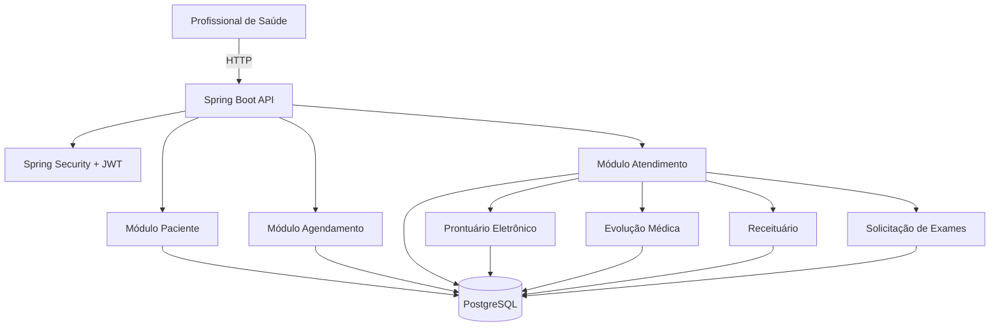

# 🏥 Electronic Health Record API (EHR)
[](https://github.com/alitakallyne/ehr-api/actions)


> Sistema de Prontuário Eletrônico Centralizado desenvolvido para clínicas e hospitais, permitindo gerenciamento de pacientes, consultas, atendimentos, evoluções médicas, prescrições e solicitações de exames de forma segura e organizada.

---

## 📌 Sobre o Projeto

Hospitais e clínicas precisam armazenar informações clínicas de forma centralizada, segura e acessível para profissionais de saúde.

Este projeto simula um sistema de Prontuário Eletrônico do Paciente (PEP), permitindo registrar todo o histórico clínico de um paciente, desde seu cadastro até consultas, internações, evoluções médicas, prescrições e exames.

O objetivo é aplicar conceitos utilizados em sistemas hospitalares reais, utilizando arquitetura em camadas, boas práticas de desenvolvimento e tecnologias amplamente utilizadas no mercado.

---
## 🎯 Problema Resolvido

O sistema permite:

- Centralizar informações clínicas do paciente
- Evitar perda de histórico médico
- Facilitar consultas e internações
- Organizar prescrições e exames
- Melhorar a rastreabilidade dos atendimentos
- Garantir acesso seguro às informações clínicas
---

## 🏗️ Arquitetura



---
## 🚀 Tech Stack


---
## 🧩 Módulos do Sistema

### 👤 Paciente

Responsável pelo cadastro e gerenciamento dos pacientes.

Funcionalidades:

- Cadastro de pacientes
- Atualização de dados cadastrais
- Consulta por CPF
- Consulta por nome
- Listagem paginada

---

### 📅 Agendamento

Responsável pelo controle das consultas.

Funcionalidades:

- Agendamento de consulta
- Reagendamento
- Cancelamento
- Consulta da agenda

---

### 🏥 Atendimento

Módulo central do sistema.

Todo atendimento gera um vínculo com o prontuário do paciente.

Funcionalidades:

- Registro de consulta
- Registro de internação
- Identificação do profissional responsável
- Data e hora do atendimento

---

### 📖 Prontuário

Responsável pelo histórico clínico completo do paciente.

Funcionalidades:

- Histórico de consultas
- Histórico de internações
- Histórico de prescrições
- Histórico de exames
- Histórico de evoluções

---

### 🩺 Evolução Médica

Registro das observações clínicas realizadas durante o atendimento.

Funcionalidades:

- Evolução médica
- Evolução de enfermagem
- Registro cronológico
- Auditoria de alterações

---

### 💊 Receituário

Controle das prescrições médicas.

Funcionalidades:

- Emissão de receitas
- Lista de medicamentos
- Posologia
- Histórico de prescrições

---

### 🔬 Exames

Solicitação e acompanhamento de exames.

Funcionalidades:

- Solicitação de exames
- Consulta das solicitações
- Resultado dos exames
- Histórico de exames realizados
---

## ✨ Features

- 🔐 Autenticação JWT Stateless
- 👤 Cadastro de pacientes
- 📅 Agendamento de consultas
- 🏥 Registro de atendimentos
- 📖 Histórico completo do prontuário
- 🩺 Evolução médica e de enfermagem
- 💊 Prescrição de medicamentos
- 🔬 Solicitação de exames
- 📄 Paginação e ordenação
- 🔍 Filtros dinâmicos com Specifications
- 🛡️ Tratamento global de exceções
- 📚 Documentação Swagger/OpenAPI
- ✅ Validação de dados com Bean Validation
- 🧪 Testes unitários e integração

---

## 🛠️ Decisões Técnicas

| Tecnologia | Motivo |
|------------|--------|
| Java 17 | Versão LTS mais recente |
| Spring Boot | Framework padrão do mercado |
| PostgreSQL | Banco relacional robusto |
| JWT | Autenticação stateless |
| JPA/Hibernate | Persistência simplificada |
| Swagger | Documentação automática |
| Docker | Ambiente reproduzível |

---

## 📁 Estrutura do Projeto

```text
src/
└── main/
    └── java/
        ├── patient/
        ├── appointment/
        ├── attendance/
        ├── medicalrecord/
        ├── evolution/
        ├── prescription/
        ├── exam/
        ├── security/
        ├── exception/
        ├── config/
        └── shared/
```

---

## 🚀 Como Rodar Localmente

### Pré-requisitos

- Java 17
- Maven
- PostgreSQL
- Docker

### Clone o projeto

```bash
git clone https://github.com/alitakallyne/medscript-api.git
```
### Configure as variáveis de ambiente

```bash
cp .env.example .env
```

Exemplo:

| Variável | Descrição |
|-----------|-----------|
| DB_URL | URL do PostgreSQL |
| DB_USERNAME | Usuário do banco |
| DB_PASSWORD | Senha do banco |
| JWT_SECRET | Chave secreta JWT |
| JWT_EXPIRATION | Tempo de expiração

###  Execute a aplicação

```bash
mvn spring-boot:run
```

A API estará disponível em:

```text
http://localhost:8080
```

---

## 📡 Principais Endpoints

### Pacientes

| Método | Endpoint |
|---------|---------|
| POST | /pacientes |
| GET | /pacientes |
| GET | /pacientes/{id} |
| PUT | /pacientes/{id} |
| DELETE | /pacientes/{id} |

### Agendamentos

| Método | Endpoint |
|---------|---------|
| POST | /agendamentos |
| GET | /agendamentos |
| PUT | /agendamentos/{id} |
| DELETE | /agendamentos/{id} |

### Atendimentos

| Método | Endpoint |
|---------|---------|
| POST | /atendimentos |
| GET | /atendimentos/{id} |

### Evoluções

| Método | Endpoint |
|---------|---------|
| POST | /evolucoes |
| GET | /evolucoes |

### Receitas

| Método | Endpoint |
|---------|---------|
| POST | /receitas |
| GET | /receitas |

### Exames

| Método | Endpoint |
|---------|---------|
| POST | /exames |
| GET | /exames |

---

## 🎯 Desafios Técnicos

- Modelagem de domínio hospitalar
- Relacionamentos complexos entre entidades
- Paginação de grandes volumes de dados
- Filtros dinâmicos com Specifications
- Segurança com JWT
- Auditoria de informações clínicas
- Organização por módulos de negócio

---

## 📈 Roadmap

- [ ] Cache Redis
- [ ] Mensageria RabbitMQ
- [ ] Observabilidade com Micrometer
- [ ] Testcontainers
- [ ] CI/CD GitHub Actions
- [ ] Docker Compose
- [ ] Controle de perfis (Médico, Recepção)

---

## 👨‍💻 Autor

**Alita Kallyne**

[](https://linkedin.com/in/alitakallyne)
[](https://github.com/alitakallyne)


---

## 📄 Licença

Este projeto está sob a licença MIT.